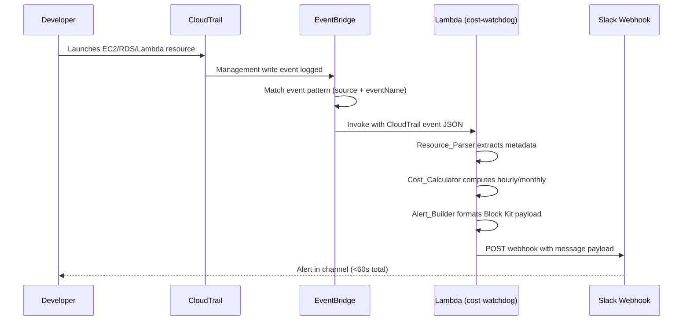

# Design Document: AWS Cost Watchdog

## Overview

AWS Cost Watchdog is an event-driven serverless alerting system that detects cost-impacting AWS resource launches (EC2, RDS, Lambda) in real time and delivers formatted Slack notifications within 60 seconds. The system uses CloudTrail for event capture, EventBridge for event routing, and a single Lambda function containing four modules: Resource_Parser, Cost_Calculator, Alert_Builder, and Notifier.

The Lambda function receives raw CloudTrail events via EventBridge, extracts resource metadata, computes cost estimates using a static pricing table, classifies severity, builds a Slack Block Kit message with a kill-switch console URL, and posts it to a configured webhook.

### Design Decisions

| Decision | Rationale |
|---|---|
| Static pricing table (not AWS Pricing API) | Eliminates external API call latency; pricing for ap-south-1 is stable enough for alerting |
| Single Lambda with internal modules (not microservices) | Minimizes cold start; entire pipeline runs in one invocation under 30s |
| Slack Block Kit (not plain text) | Structured fields, colour-coded severity, clickable links |
| ZIP packaging with vendored deps (not Lambda layers) | Self-contained deployment; no cross-account layer dependency |
| Environment variables for all config | Zero hardcoded secrets; deploy to any account without code changes |

---

## Architecture

### Event Flow

```
┌─────────────┐     ┌────────────┐     ┌──────────────────┐     ┌────────────┐
│ AWS Account │────▶│ CloudTrail │────▶│  EventBridge Rule │────▶│   Lambda   │
│ (EC2/RDS/   │     │ (Mgmt      │     │  (Filters:        │     │ cost-      │
│  Lambda)    │     │  Write Evts)│     │   RunInstances,   │     │ watchdog   │
└─────────────┘     └────────────┘     │   CreateDBInst,   │     │            │
                                        │   CreateFunc)     │     │ ┌────────┐ │
                                        └──────────────────┘     │ │Resource │ │
                                                                  │ │ Parser │ │
                                                                  │ └───┬────┘ │
                                                                  │     │      │
                                                                  │ ┌───▼────┐ │
                                                                  │ │  Cost  │ │
                                                                  │ │ Calc   │ │
                                                                  │ └───┬────┘ │
                                                                  │     │      │
                                                                  │ ┌───▼────┐ │
                                                                  │ │ Alert  │ │
                                                                  │ │Builder │ │
                                                                  │ └───┬────┘ │
                                                                  │     │      │
                                                                  │ ┌───▼────┐ │     ┌───────────┐
                                                                  │ │Notifier│─┼────▶│   Slack   │
                                                                  │ └────────┘ │     │  Webhook  │
                                                                  └────────────┘     └───────────┘
```

### Sequence Diagram



---

## Components and Interfaces

### File Layout

```
cost-watchdog/
├── lambda/
│   ├── handler.py              # Lambda entry point (lambda_handler)
│   ├── resource_parser.py      # Per-service CloudTrail event parsers
│   ├── cost_calculator.py      # Pricing table + cost math + severity
│   ├── alert_builder.py        # Slack Block Kit message construction
│   ├── notifier.py             # HTTP POST to Slack webhook
│   └── vendor/                 # Vendored dependencies (requests, urllib3, etc.)
│       └── requests/
├── infrastructure/
│   └── setup.sh                # AWS CLI setup commands in order
├── tests/
│   ├── conftest.py             # Shared fixtures
│   ├── fixtures/               # Mock CloudTrail event JSONs
│   │   ├── ec2_run_instances.json
│   │   ├── rds_create_db.json
│   │   └── lambda_create_function.json
│   ├── test_resource_parser.py
│   ├── test_cost_calculator.py
│   ├── test_alert_builder.py
│   ├── test_notifier.py
│   └── test_handler.py         # Integration test of full pipeline
├── requirements.txt            # requests==2.31.0
├── Makefile                    # build, test, deploy targets
└── README.md
```

### Module Interfaces

#### handler.py

```python
def lambda_handler(event: dict, context: Any) -> dict:
    """
    Entry point invoked by EventBridge.
    Returns: {"statusCode": 200|500, "body": "alert sent"|"ignored"|"processing error"|"configuration error"}
    """
```

#### resource_parser.py

```python
def parse_event(detail: dict, event_name: str) -> dict:
    """
    Dispatches to per-service parser based on event_name.
    
    Returns:
        {
            "resource_type": "EC2" | "RDS" | "Lambda",
            "detail": str,           # human-readable resource description
            "region": str,           # AWS region
            "launched_by": str,      # IAM ARN
            "instance_type": str,    # raw type/class for cost lookup
            "instance_count": int,   # number of instances (EC2 only, default 1)
        }
    """

def parse_ec2(detail: dict) -> dict: ...
def parse_rds(detail: dict) -> dict: ...
def parse_lambda(detail: dict) -> dict: ...
```

#### cost_calculator.py

```python
def calculate_cost(resource_type: str, instance_type: str, instance_count: int = 1) -> dict:
    """
    Looks up hourly price, computes monthly, converts to INR.
    
    Returns:
        {
            "hourly_usd": float,    # rounded to 4 decimal places
            "monthly_usd": float,   # rounded to 2 decimal places
            "hourly_inr": float,    # rounded to 2 decimal places
            "monthly_inr": float,   # rounded to 2 decimal places
            "severity": "LOW" | "MEDIUM" | "HIGH",
        }
    """

def get_severity(hourly_usd: float) -> str: ...
def get_inr_rate() -> float: ...
```

#### alert_builder.py

```python
def build_slack_payload(resource_info: dict, cost_info: dict) -> dict:
    """
    Constructs Slack Block Kit attachment payload.
    
    Returns: dict ready for JSON serialization and POST to Slack webhook.
    """

def build_kill_switch_url(resource_type: str, region: str, resource_id: str) -> str:
    """
    Generates AWS Console deep-link URL for the resource.
    """
```

#### notifier.py

```python
def send_slack_alert(payload: dict) -> None:
    """
    POSTs payload to SLACK_WEBHOOK_URL.
    Raises exception on failure (non-200, timeout, invalid URL).
    """
```

### Data Flow Between Modules

```
EventBridge event (dict)
    │
    ▼
┌─────────────────┐
│ resource_parser  │──▶ resource_info: dict
└─────────────────┘
    │
    ▼
┌─────────────────┐
│ cost_calculator  │──▶ cost_info: dict (includes severity)
└─────────────────┘
    │
    ▼
┌─────────────────┐
│ alert_builder    │──▶ slack_payload: dict
└─────────────────┘
    │
    ▼
┌─────────────────┐
│ notifier         │──▶ HTTP 200 OK (or raises exception)
└─────────────────┘
```

---

## Data Models

### Resource Info (output of Resource_Parser)

```python
ResourceInfo = {
    "resource_type": str,       # "EC2" | "RDS" | "Lambda"
    "detail": str,              # "2x t3.large" | "mydb (mysql, db.m5.large)" | "my-func (256MB)"
    "region": str,              # "ap-south-1"
    "launched_by": str,         # "arn:aws:iam::123456789012:user/dev"
    "instance_type": str,       # "t3.large" | "db.m5.large" | "256"  (memory for Lambda)
    "instance_count": int,      # 1-200 for EC2, always 1 for RDS/Lambda
    "resource_id": str,         # instance ID / DB identifier / function name
}
```

### Cost Info (output of Cost_Calculator)

```python
CostInfo = {
    "hourly_usd": float,        # e.g. 0.1728, rounded to 4 decimals
    "monthly_usd": float,       # e.g. 124.42, rounded to 2 decimals
    "hourly_inr": float,        # e.g. 14.52, rounded to 2 decimals
    "monthly_inr": float,       # e.g. 10451.28, rounded to 2 decimals
    "severity": str,            # "LOW" | "MEDIUM" | "HIGH"
}
```

### Pricing Table Format

```python
# Static dict in cost_calculator.py

EC2_PRICES: dict[str, float] = {
    # instance_type -> hourly USD (on-demand, ap-south-1)
    "t2.micro":     0.0116,
    "t2.small":     0.023,
    "t2.medium":    0.0464,
    "t3.micro":     0.0108,
    "t3.small":     0.0216,
    "t3.medium":    0.0432,
    "t3.large":     0.0864,
    "t3.xlarge":    0.1728,
    "m5.large":     0.096,
    "m5.xlarge":    0.192,
    "c5.large":     0.085,
    "c5.xlarge":    0.17,
    "r5.large":     0.126,
    "p3.2xlarge":   3.06,
    "p4d.24xlarge": 32.77,
}

RDS_PRICES: dict[str, float] = {
    # db_instance_class -> hourly USD (on-demand, ap-south-1)
    "db.t3.micro":  0.017,
    "db.t3.small":  0.034,
    "db.t3.medium": 0.068,
    "db.m5.large":  0.171,
    "db.m5.xlarge": 0.342,
    "db.r5.large":  0.24,
}

DEFAULT_EC2_PRICE = 0.10    # fallback for unknown instance types
DEFAULT_RDS_PRICE = 0.20    # fallback for unknown DB classes
DEFAULT_INR_RATE  = 84      # USD to INR conversion
```

### Slack Payload Structure (Block Kit)

```json
{
  "attachments": [
    {
      "color": "#danger" | "#warning" | "#2eb886",
      "blocks": [
        {
          "type": "header",
          "text": { "type": "plain_text", "text": "AWS Cost Watchdog Alert" }
        },
        {
          "type": "section",
          "fields": [
            { "type": "mrkdwn", "text": "*Resource Type:*\nEC2" },
            { "type": "mrkdwn", "text": "*Details:*\n2x t3.large" },
            { "type": "mrkdwn", "text": "*Region:*\nap-south-1" },
            { "type": "mrkdwn", "text": "*Launched By:*\narn:aws:iam::...user/dev" },
            { "type": "mrkdwn", "text": "*Hourly Cost:*\n$0.1728 (~₹14.52)" },
            { "type": "mrkdwn", "text": "*Monthly Cost:*\n$124.42 (~₹10,451.28)" },
            { "type": "mrkdwn", "text": "*Severity:*\n🟡 MEDIUM" }
          ]
        },
        {
          "type": "actions",
          "elements": [
            {
              "type": "button",
              "text": { "type": "plain_text", "text": "Kill Resource" },
              "url": "https://console.aws.amazon.com/ec2/v2/home?region=ap-south-1#Instances",
              "style": "danger"
            }
          ]
        }
      ]
    }
  ]
}
```

### EventBridge Rule Event Pattern

```json
{
  "source": ["aws.ec2", "aws.rds", "aws.lambda"],
  "detail-type": ["AWS API Call via CloudTrail"],
  "detail": {
    "eventName": [
      "RunInstances",
      "CreateDBInstance",
      "CreateFunction20150331"
    ]
  }
}
```

### IAM Execution Role Policy

**Trust Policy:**
```json
{
  "Version": "2012-10-17",
  "Statement": [
    {
      "Effect": "Allow",
      "Principal": { "Service": "lambda.amazonaws.com" },
      "Action": "sts:AssumeRole"
    }
  ]
}
```

**Permissions Policy:**
```json
{
  "Version": "2012-10-17",
  "Statement": [
    {
      "Effect": "Allow",
      "Action": [
        "logs:CreateLogGroup",
        "logs:CreateLogStream",
        "logs:PutLogEvents"
      ],
      "Resource": "arn:aws:logs:ap-south-1:*:log-group:/aws/lambda/cost-watchdog:*"
    },
    {
      "Effect": "Allow",
      "Action": "sns:Publish",
      "Resource": "arn:aws:sns:ap-south-1:*:cost-watchdog-alerts"
    }
  ]
}
```

### Environment Variables

| Variable | Required | Default | Description |
|---|---|---|---|
| `SLACK_WEBHOOK_URL` | Yes | — | Slack incoming webhook HTTPS URL |
| `SNS_TOPIC_ARN` | No | — | SNS topic ARN for email alerts (optional) |
| `INR_RATE` | No | `84` | USD to INR conversion rate |
| `WATCHED_REGION` | No | `ap-south-1` | AWS region to monitor |

### Kill-Switch URL Templates

| Resource | URL Template |
|---|---|
| EC2 | `https://console.aws.amazon.com/ec2/v2/home?region={region}#Instances` |
| RDS | `https://console.aws.amazon.com/rds/home?region={region}#database:id={db_instance_identifier}` |
| Lambda | `https://console.aws.amazon.com/lambda/home?region={region}#/functions/{function_name}` |

### Deployment Packaging

```bash
# 1. Install dependencies into a local directory
pip install requests -t lambda/vendor/ --no-deps

# 2. Add vendor path to sys.path in handler.py
#    import sys; sys.path.insert(0, os.path.join(os.path.dirname(__file__), "vendor"))

# 3. Zip the lambda/ directory contents (not the directory itself)
cd lambda && zip -r ../function.zip . && cd ..

# 4. Deploy
aws lambda create-function \
  --function-name cost-watchdog \
  --runtime python3.11 \
  --handler handler.lambda_handler \
  --zip-file fileb://function.zip \
  --memory-size 128 \
  --timeout 30 \
  --role arn:aws:iam::<ACCOUNT_ID>:role/cost-watchdog-lambda-role \
  --environment "Variables={SLACK_WEBHOOK_URL=...,INR_RATE=84}" \
  --region ap-south-1
```

---

## Correctness Properties

*A property is a characteristic or behavior that should hold true across all valid executions of a system — essentially, a formal statement about what the system should do. Properties serve as the bridge between human-readable specifications and machine-verifiable correctness guarantees.*

### Property 1: Cost calculation round-trip consistency

*For any* valid resource metadata containing non-negative `hourly_usd` and `monthly_usd` values, formatting these values to string representation and parsing them back SHALL produce values equal to the originals within a tolerance of $0.001.

**Validates: Requirements 9.6**

### Property 2: Monthly cost derivation

*For any* hourly cost value (non-negative float), the monthly cost SHALL equal `hourly_cost * 24 * 30` rounded to 2 decimal places.

**Validates: Requirements 3.6**

### Property 3: INR conversion correctness

*For any* USD cost value and any positive INR_RATE, the INR equivalent SHALL equal `usd * INR_RATE` rounded to 2 decimal places.

**Validates: Requirements 3.7**

### Property 4: Severity boundary classification

*For any* non-negative hourly_usd value, the severity classification SHALL be: LOW if `0 <= hourly_usd < 0.10`, MEDIUM if `0.10 <= hourly_usd <= 1.00`, HIGH if `hourly_usd > 1.00`.

**Validates: Requirements 4.1, 4.2, 4.3**

### Property 5: Instance count scaling

*For any* EC2 instance type with a known price and any instance count between 1 and 200, the total hourly cost SHALL equal `per_instance_price * count`.

**Validates: Requirements 3.5**

### Property 6: Missing field substitution

*For any* CloudTrail event detail dict with one or more required fields set to None or absent, the Resource_Parser SHALL return a valid dictionary with `"unknown"` substituted for each missing field and SHALL not raise an exception.

**Validates: Requirements 2.4**

### Property 7: Kill-switch URL validity

*For any* resource type, region string, and resource identifier, the generated Kill_Switch_URL SHALL be no longer than 2048 characters and SHALL contain only valid URL characters after encoding.

**Validates: Requirements 5.6**

### Property 8: Monetary value rounding

*For any* valid resource metadata dictionary, all `hourly_usd` values SHALL be rounded to exactly 4 decimal places and all `monthly_usd` and `monthly_inr` values SHALL be rounded to exactly 2 decimal places.

**Validates: Requirements 2.6, 3.1, 3.3**

### Property 9: Unknown type default pricing

*For any* EC2 instance type string not present in the Pricing_Table, the Cost_Calculator SHALL return a default hourly price of $0.10. *For any* RDS instance class string not present in the Pricing_Table, the Cost_Calculator SHALL return a default hourly price of $0.20.

**Validates: Requirements 3.2, 3.4**

### Property 10: Slack payload completeness

*For any* valid resource_info and cost_info dictionaries, the Alert_Builder SHALL produce a Slack payload containing all required fields: resource type, resource detail, region, launched-by ARN, hourly cost (USD and INR), monthly cost (USD and INR), severity indicator, and kill-switch URL.

**Validates: Requirements 6.2**

---

## Error Handling

### Error Strategy by Module

| Module | Error Condition | Handling |
|---|---|---|
| `handler.py` | Missing `SLACK_WEBHOOK_URL` env var | Log error, return `{"statusCode": 500, "body": "configuration error"}` |
| `handler.py` | Unsupported `eventName` | Return `{"statusCode": 200, "body": "ignored"}` (not an error) |
| `handler.py` | Unexpected exception during processing | Log full traceback, return `{"statusCode": 500, "body": "processing error"}` |
| `resource_parser` | Missing field in CloudTrail detail | Substitute `"unknown"`, continue processing |
| `resource_parser` | Missing or invalid instance count | Default to 1 |
| `cost_calculator` | Unknown instance type/class | Return default price ($0.10 EC2, $0.20 RDS), log warning |
| `cost_calculator` | Invalid `INR_RATE` env var (non-numeric/negative) | Use default 84, log warning |
| `cost_calculator` | Pricing lookup failure with no default | Assign MEDIUM severity, log warning |
| `alert_builder` | Missing region or resource_id for kill-switch URL | Include partial URL, append warning text to alert |
| `notifier` | `SLACK_WEBHOOK_URL` not a valid HTTPS URL | Log validation error, raise exception |
| `notifier` | HTTP response != 200 | Log status + body, raise exception |
| `notifier` | Network timeout (>5s) | Treat as failed delivery, raise exception |
| `notifier` | Connection refused / DNS failure | Log error details, raise exception |

### Retry Behaviour

- **EventBridge → Lambda**: AWS-managed retry up to 2 times with exponential backoff on Lambda invocation failure.
- **Lambda → Slack**: No application-level retry. A single failed POST raises an exception which marks the Lambda invocation as failed, triggering the EventBridge retry.
- **Design rationale**: Keeping the Lambda simple (fail-fast) and relying on EventBridge's built-in retry provides idempotent retry semantics without added complexity.

### Logging Strategy

All log output goes to CloudWatch Logs via `print()` / Python `logging` module:

1. **On invocation**: Log full raw event payload (Requirement 7.6)
2. **On warning**: Log missing fields, unknown instance types, invalid INR_RATE
3. **On error**: Log full exception traceback with context
4. **On success**: Log resource type + event name confirmation

---

## Testing Strategy

### Framework and Tools

- **Test runner**: `pytest` with `pytest-mock`
- **Property testing**: `hypothesis` (minimum 100 examples per property)
- **Mocking**: `unittest.mock` for Slack HTTP calls and environment variables
- **No AWS credentials required**: All tests run locally with mock data

### Test Categories

#### 1. Unit Tests (example-based)

| Test File | Covers | Key Assertions |
|---|---|---|
| `test_resource_parser.py` | EC2, RDS, Lambda event parsing | Correct field extraction, `"unknown"` substitution |
| `test_cost_calculator.py` | Pricing lookup, severity boundaries | Boundary values ($0.099→LOW, $0.10→MEDIUM, $1.00→MEDIUM, $1.01→HIGH) |
| `test_alert_builder.py` | Block Kit formatting, kill-switch URLs | All fields present, URL format correct |
| `test_notifier.py` | HTTP posting, error handling | Mock receives correct payload, exceptions on failure |
| `test_handler.py` | Full pipeline integration | End-to-end with mocked Slack, correct status codes |

#### 2. Property Tests (hypothesis-based)

Each property from the Correctness Properties section maps to one `@given` test:

| Property | Generator Strategy | Assertion |
|---|---|---|
| P1: Round-trip consistency | `st.floats(min_value=0, max_value=100000)` for costs | `abs(parsed - original) < 0.001` |
| P2: Monthly derivation | `st.floats(min_value=0, max_value=10000)` for hourly | `monthly == round(hourly * 720, 2)` |
| P3: INR conversion | `st.floats` for USD, `st.floats(min_value=0.01)` for rate | `inr == round(usd * rate, 2)` |
| P4: Severity boundaries | `st.floats(min_value=0, max_value=100)` | Correct bucket per threshold |
| P5: Instance count scaling | `st.integers(1, 200)`, `st.sampled_from(EC2_PRICES)` | `total == price * count` |
| P6: Missing field substitution | `st.fixed_dictionaries` with `st.none()` fields | No exception, `"unknown"` in output |
| P7: Kill-switch URL validity | `st.text` for region/id | `len(url) <= 2048`, valid URL chars |
| P8: Monetary rounding | `st.floats(min_value=0, max_value=100000)` | Decimal places match spec |
| P9: Unknown type defaults | `st.text` (excluding known keys) | EC2→$0.10, RDS→$0.20 |
| P10: Payload completeness | Random valid resource_info + cost_info dicts | All required keys present |

#### 3. Fixture Files

Each fixture is a minimal CloudTrail event JSON for the supported event type:

- `ec2_run_instances.json`: RunInstances with `t3.medium`, count 2
- `rds_create_db.json`: CreateDBInstance with `db.m5.large`, mysql engine
- `lambda_create_function.json`: CreateFunction20150331 with 256MB memory

#### 4. Test Configuration

```ini
# pytest.ini
[pytest]
testpaths = tests
python_files = test_*.py

# hypothesis settings
[hypothesis]
max_examples = 100
```

### Running Tests

```bash
# All tests (no AWS credentials, no network)
pytest tests/ -v

# Property tests only
pytest tests/ -v -k "property"

# With coverage
pytest tests/ --cov=lambda --cov-report=term-missing
```
